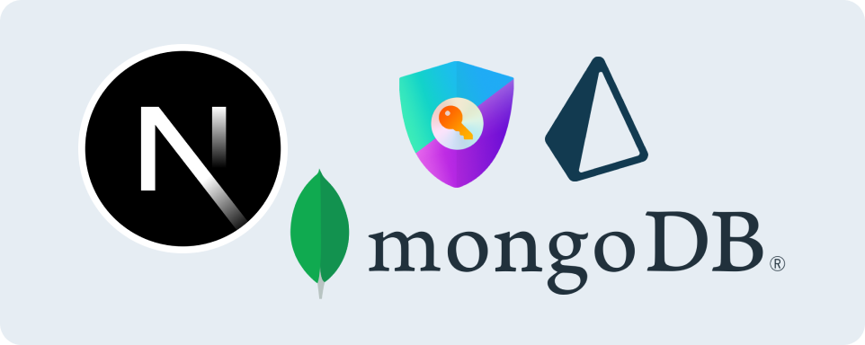

# Next.js MongoDB Prisma Auth Template

[**`🌐 App Demo`**](https://nextjs-mongodb-prisma-auth-template.vercel.app/)  
🗺️ This is a template repository for building a Next.js application with MongoDB, Prisma, and Next Auth authentication.

## Features

- 🚀 Authentication system with user registration, login, and logout functionality
- 🚀 Protected Routes
- 🚀 Next.js framework for server-side rendering and client-side rendering
- 🚀 MongoDB for database storage
- 🚀 Prisma for database ORM

## Getting Started

1. Clone the repository
2. Install dependencies: `npm install`
3. Set up your environment variables by creating a `.env` `or` `.env.local` file based on the `.env.example` file.
4. Start the development server: `npm run dev`

## What you need to know

- `auth.config.ts` `&&` `app/lib/actions.ts` handles auth logic
- `/lib/form-schemas.ts` zod for validation
- `middleware.ts` handles protected routes

## Contributing

Contributions are welcome! If you find any issues or have suggestions for improvements, please open an issue or submit a pull request.

## License

This project is licensed under the [MIT License](LICENSE).
